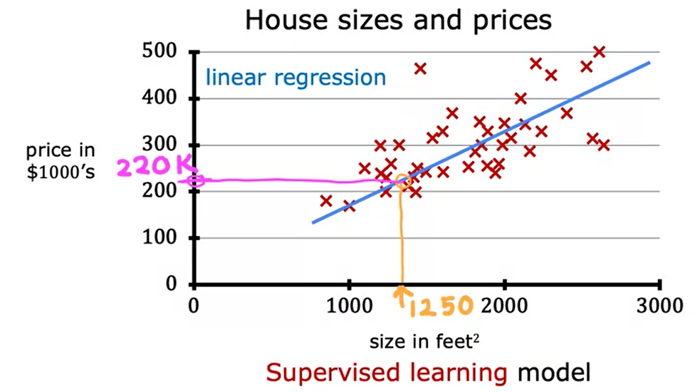
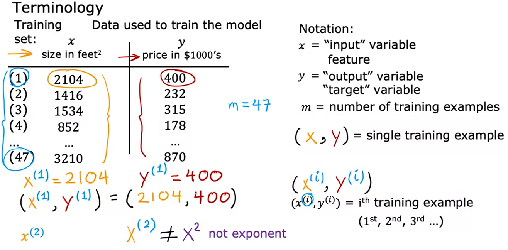
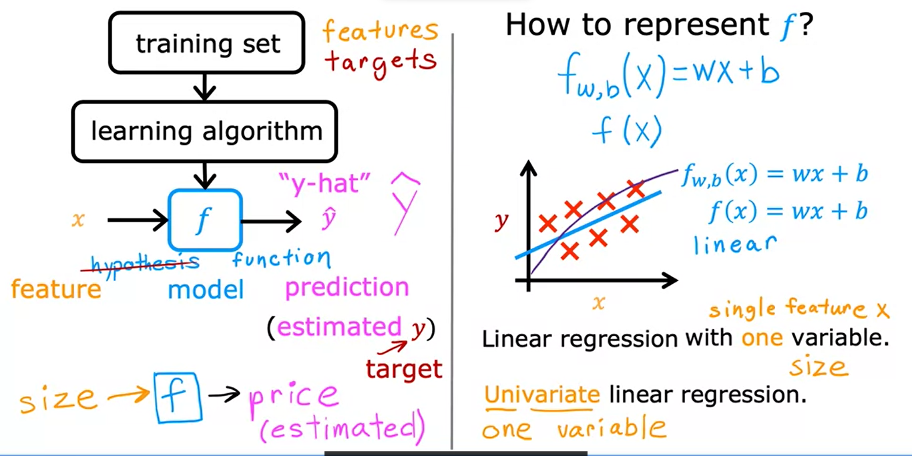
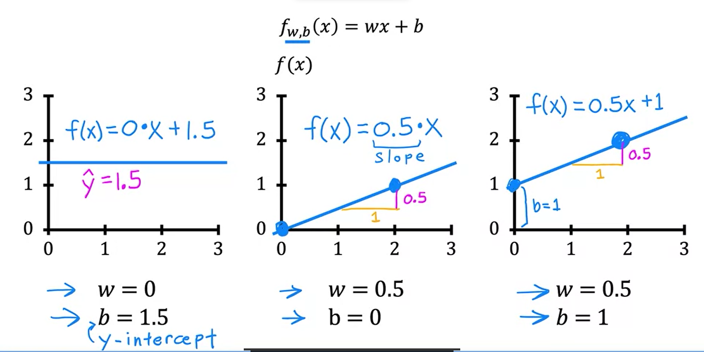
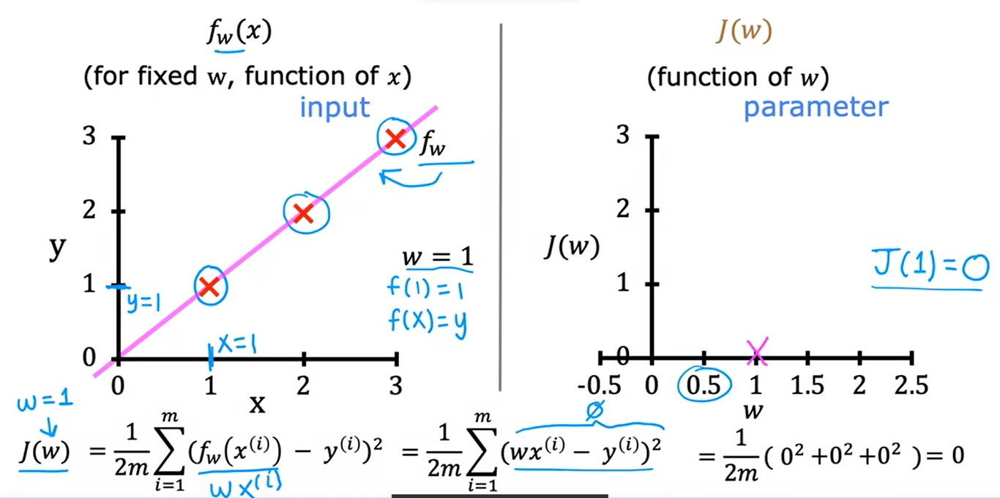
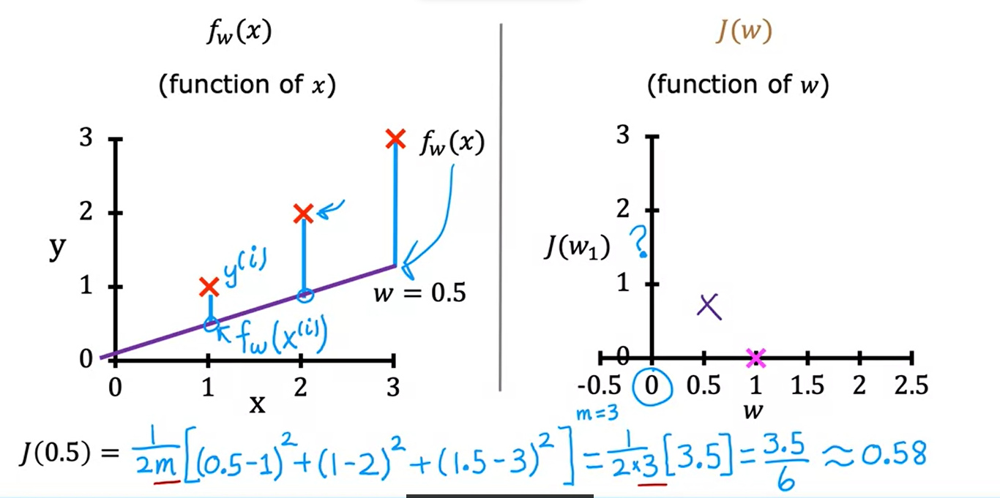
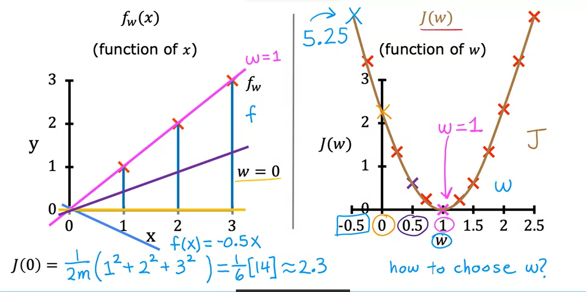
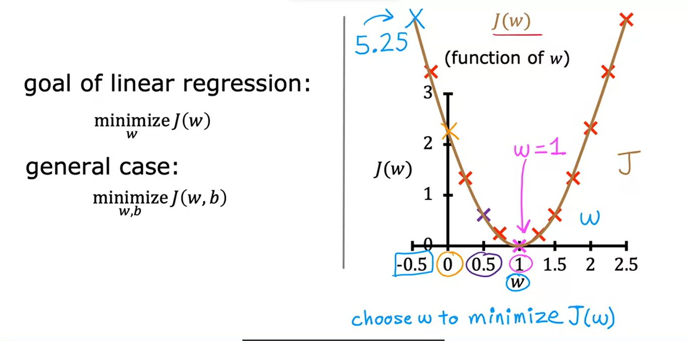
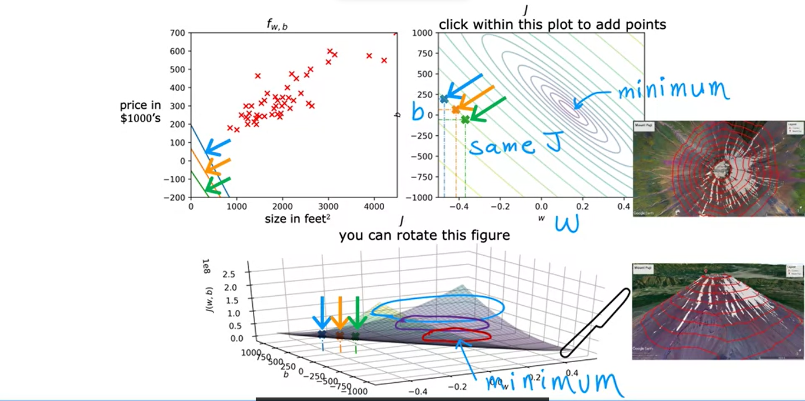

# Supervised Machine Learning: Regression and Classification

Link: Supervised Machine Learning: Regression and Classification

# 1 - O que é Machine Learning?

É o campo de estudo que dá aos computadores a habilidade de aprender sem ser explicitamente programado.

Arthur Samuel(1959)

**Aprendizagem Supervisionado**:

- Usado no mundo real.
- Muitos avanços.

**Aprendizagem não Supervisionado:**

- Sistemas de recomendação
- Aprendizado de reforço.

# Aprendizagem Supervisionada.

Ocorre quando fazemos com que o algoritmo de aprendizagem aprenda através de exemplos.

Dado uma entrada x, teremos tal entrada y.

Depois de ver vários exemplos disso, o o algoritmo de aprendizagem é capaz de, a partir de uma entrada x, adivinhar/prever aproximadamente a saída y.

Previsão de uma saída y, dada uma entrada x.

Ele aprende a partir das respostas corretas.

**Regressão**: Quanto tentamos prever um número entre infinitas saídas diferentes.

**Classificação**: Quanto tentamos prever algo dentre opções finitas e pequenas.

Algoritmos de classificação preveem categorias(existem categorias finitas e elas são poucas).

# Aprendizagem não Supervisionada.

Nele, não supervisionamos o algoritmos. Ele vai simplesmente descobrir coisas interessantes acerca do dado fornecido sem nenhuma especificação da nossa parte. Ele mesmo vai encontrar as coisas que ele achar interessantes, ou então quais padrões ou estruturas existem nesse dado.

- Algoritmo de Agrupamento.
  - Pega um conjunto de dados e tenta encontrar padrões ou estruturas nesse dado. E assim agrupa os semelhantes e separa os diferentes.
  -

Nele os dados só vem com os inputs x, mas nenhum output y.

O trabalho do algoritmo é o de encontrar uma estrutura, um padrão ou algo interessante nesses dados.

- Algoritmo de Agrupamento.
  - Agrupa dados semelhantes.
- Detecção de Anomalia.
  - É utilizada para detectar eventos incomuns.
    - Detecção de Fraude no sistema financeiro.
- Redução de Dimensionalidade.
  - Comprime dados utilizando menos números.

# Modelo de Regressão Linear

- Exemplo: Prever o preço de uma casa baseado no seu tamanho.
  
  Ele é um modelo de aprendizagem supervisionado porque você está dando pro algoritmo dados que possuem as respostas corretas.

  Esse modelo é chamado de Regressão pois consegue prever números.

Existem outros modelos de regressão.

Lembre-se: Outro modelo de aprendizagem supervisionada é o o de Classificação, que prevê categorias.

**Classificação**: Existe um pequeno número de possíveis saídas.

- Exemplo: Um modelo que tenta diferenciar um cachorro de um gato.
  **Regressão**: Existem infinitos números possíveis de saídas.

## Training set(Conjunto de treinamento)

Um data set que é utilizado para treinar uma Inteligência Artificial.

$x$ = É a variável de input.

$y$ = É a variável alvo/output.

$m$ = Número de exemplos de treinamento.

$(x, y)$ = Um exemplo de treinamento.

$(x^i, y^i)$ = Corresponde ao primeiro, segundo, terceiro... exemplo de treinamento.

## Fluxo de funcionamento

Conjunto de Treinamento &rarr; Algoritmo de Aprendizagem &rarr; $f$(função, antigamente chamada de hipótese.)
O trabalho dessa função é, ao receber um $x$, prever, com base no que ela aprendeu, o valor de $y$ que é chamado aqui de $\hat{y}$(y-hat)

$x$ = Recurso de entrada(input feature)

$\hat{y}$ = Saída do modelo. É a estimativa ou predição do $y$. Pode ser ou não o valor verdadeiro.

    O símbolo y sem o chapéu refere-se ao alvo. Que é o valor real no conjunto de treinamento.

$f$= É chamada de modelo

### Como representar $f$?

$f_{w,b} = wx + b$

$f$ é uma função que vai receber $x$, e, dependendo dos valores de $w$ e $b$, ela vai ter alguma saída que será chamada de $\hat{y}$, que é uma estimativa do valor correto.

Formato alternativo: $f(x)$

Essa representação de função diz respeito a uma Regressão Linear com apenas uma única variável ou Regressão Linear Univariada
$f_{w,b}$

# Função de custo

A primeira coisa necessária para implementar um modelo de regressão linear é encontrar uma **função de custo**.

Modelo: $f_{w,b} = wx + b$

- $w, b$: **Parâmetros**(também podem ser chamados de coeficientes ou pesos).
  - Sãos as variáveis que você pode ajustar durante o treinamento para melhorar o modelo.

Dependendo dos valores que eu escolher para $w, b$, uma nova função é construída.

Como encontrar os valores de $w$ e $b$, de modo que que o valor de saída $\hat{y}$ seja uma esmativa correta do valor verdadeiro de $y$?

Para responder a essa pergunta vamos ver como medir quão bem uma linha se ajusta aos dados de treinamento.
Para fazer isso vamos construir uma **Função de Custo**.

A **Função de Custo** pega a estimativa $\hat{y}$ e compara com o alvo $y$ fazendo: $\hat{y} - y$. A diferença entre esses dois é chamada de **erro**.

Com isso, medimos o quão longe a estimativa está do valor alvo. Agora vamos computar o quadrado do erro de todo o conjunto de treinamento: $\sum_{i = 1}^{m} (\hat{y}^{(i)} - y{(i)})^2$

Para não ter que ter problemas computando cada um dos dados de treinamento de um conjunto de dados quando temos muitos dados, por convenção, nós vamos computar a a média do erro ao quadrado, ao invés do total(e por convenção, são 2 vezes o m):

**Função de Custo de Erro Quadrado**

É a mais comum utilizada para regressão linear.

 $J(w,b)=\frac{1}{2m} \sum_{i = 1}^{m} (\hat{y}^{(i)} - y^{(i)})^2$

$\hat{y} = f_{w, b}(x^{(i)})$

$f_{w, b}(x^{(i)}) =  wx^(i) + b$

$m$: é o número de exemplos de treinamento.

# Intuição da Função de Custo

### Modelo: 
- $f_{w,b} = wx + b$

### Parâmetros: 
- $w, b$

### Função de Custo:
- $J(w,b)=\frac{1}{2m} \sum_{i = 1}^{m} (\hat{y}^{(i)} - y^{(i)})^2$
### Objetivo:
- Minimizar $J(w, b)$
  - Encontrar uma valor de w, b que minimize o valor de $J(w, b)$.

A ideia é encontrar um valor de w e b que se sencaixe bem nos dados de treinamento.  Para medir o quão bem a escolha foi feita, utilizamos a função de custo. A função de custo mede qual é o valor da diferença entre o y verdadeiro e o $\hat{y}^{(i)}$

## Exemplo de uma aplicação simplificada da função de custo:

$b=0$

A função de custo, a partir do $\hat{y}^{(i)}$ e do $y$, descobre o custo, o erro que o valor de $w$ causou.

Quando menor o valor da função $J(w)$, melhor é o valor de $w$ escolhido.

Por fim, o objetivo é minimizar o valor da função de custo: $j(w)$

# Visualizando a função de custo.

O grafo na posição superior direita é como se fosse o grafo de baixo cortado. Todos os pontos que estão na mesma linha possuem o mesmo custo J. Esse graço possui B e W como eixos. Quando mais você se aproxima do meio dele, mais você se aproxima do custo mínimo da função J.
Lembre-se. O gráfico da função de custo tem um formato de uma bacia.