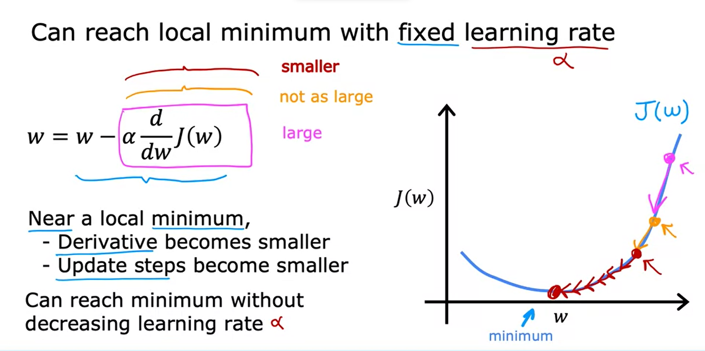

# Supervised Machine Learning: Regression and Classification

Link: Supervised Machine Learning: Regression and Classification

# 1 - O que é Machine Learning?

É o campo de estudo que dá aos computadores a habilidade de aprender sem ser explicitamente programado.

Arthur Samuel(1959)

**Aprendizagem Supervisionado**:

- Usado no mundo real.
- Muitos avanços.

**Aprendizagem não Supervisionado:**

- Sistemas de recomendação
- Aprendizado de reforço.

# Aprendizagem Supervisionada.

Ocorre quando fazemos com que o algoritmo de aprendizagem aprenda através de exemplos.

Dado uma entrada x, teremos tal entrada y.

Depois de ver vários exemplos disso, o o algoritmo de aprendizagem é capaz de, a partir de uma entrada x, adivinhar/prever aproximadamente a saída y.

Previsão de uma saída y, dada uma entrada x.

Ele aprende a partir das respostas corretas.

**Regressão**: Quanto tentamos prever um número entre infinitas saídas diferentes.

**Classificação**: Quanto tentamos prever algo dentre opções finitas e pequenas.

Algoritmos de classificação preveem categorias(existem categorias finitas e elas são poucas).

# Aprendizagem não Supervisionada.

Nele, não supervisionamos o algoritmos. Ele vai simplesmente descobrir coisas interessantes acerca do dado fornecido sem nenhuma especificação da nossa parte. Ele mesmo vai encontrar as coisas que ele achar interessantes, ou então quais padrões ou estruturas existem nesse dado.

- Algoritmo de Agrupamento.
  - Pega um conjunto de dados e tenta encontrar padrões ou estruturas nesse dado. E assim agrupa os semelhantes e separa os diferentes.
  -

Nele os dados só vem com os inputs x, mas nenhum output y.

O trabalho do algoritmo é o de encontrar uma estrutura, um padrão ou algo interessante nesses dados.

- Algoritmo de Agrupamento.
  - Agrupa dados semelhantes.
- Detecção de Anomalia.
  - É utilizada para detectar eventos incomuns.
    - Detecção de Fraude no sistema financeiro.
- Redução de Dimensionalidade.
  - Comprime dados utilizando menos números.

# Modelo de Regressão Linear

- Exemplo: Prever o preço de uma casa baseado no seu tamanho.
  
  Ele é um modelo de aprendizagem supervisionado porque você está dando pro algoritmo dados que possuem as respostas corretas.

  Esse modelo é chamado de Regressão pois consegue prever números.

Existem outros modelos de regressão.

Lembre-se: Outro modelo de aprendizagem supervisionada é o o de Classificação, que prevê categorias.

**Classificação**: Existe um pequeno número de possíveis saídas.

- Exemplo: Um modelo que tenta diferenciar um cachorro de um gato.
  **Regressão**: Existem infinitos números possíveis de saídas.

## Training set(Conjunto de treinamento)

Um data set que é utilizado para treinar uma Inteligência Artificial.

$x$ = É a variável de input.

$y$ = É a variável alvo/output.

$m$ = Número de exemplos de treinamento.

$(x, y)$ = Um exemplo de treinamento.

$(x^i, y^i)$ = Corresponde ao primeiro, segundo, terceiro... exemplo de treinamento.

## Fluxo de funcionamento

Conjunto de Treinamento &rarr; Algoritmo de Aprendizagem &rarr; $f$(função, antigamente chamada de hipótese.)
O trabalho dessa função é, ao receber um $x$, prever, com base no que ela aprendeu, o valor de $y$ que é chamado aqui de $\hat{y}$(y-hat)

$x$ = Recurso de entrada(input feature)

$\hat{y}$ = Saída do modelo. É a estimativa ou predição do $y$. Pode ser ou não o valor verdadeiro.

    O símbolo y sem o chapéu refere-se ao alvo. Que é o valor real no conjunto de treinamento.

$f$= É chamada de modelo

### Como representar $f$?

$f_{w,b} = wx + b$

$f$ é uma função que vai receber $x$, e, dependendo dos valores de $w$ e $b$, ela vai ter alguma saída que será chamada de $\hat{y}$, que é uma estimativa do valor correto.

Formato alternativo: $f(x)$

Essa representação de função diz respeito a uma Regressão Linear com apenas uma única variável ou Regressão Linear Univariada
$f_{w,b}$

# Função de custo

A primeira coisa necessária para implementar um modelo de regressão linear é encontrar uma **função de custo**.

Modelo: $f_{w,b} = wx + b$

- $w, b$: **Parâmetros**(também podem ser chamados de coeficientes ou pesos).
  - Sãos as variáveis que você pode ajustar durante o treinamento para melhorar o modelo.

Dependendo dos valores que eu escolher para $w, b$, uma nova função é construída.

Como encontrar os valores de $w$ e $b$, de modo que que o valor de saída $\hat{y}$ seja uma esmativa correta do valor verdadeiro de $y$?

Para responder a essa pergunta vamos ver como medir quão bem uma linha se ajusta aos dados de treinamento.
Para fazer isso vamos construir uma **Função de Custo**.

A **Função de Custo** pega a estimativa $\hat{y}$ e compara com o alvo $y$ fazendo: $\hat{y} - y$. A diferença entre esses dois é chamada de **erro**.

Com isso, medimos o quão longe a estimativa está do valor alvo. Agora vamos computar o quadrado do erro de todo o conjunto de treinamento: $\sum_{i = 1}^{m} (\hat{y}^{(i)} - y{(i)})^2$

Para não ter que ter problemas computando cada um dos dados de treinamento de um conjunto de dados quando temos muitos dados, por convenção, nós vamos computar a a média do erro ao quadrado, ao invés do total(e por convenção, são 2 vezes o m):

**Função de Custo de Erro Quadrado**

É a mais comum utilizada para regressão linear.

 $J(w,b)=\frac{1}{2m} \sum_{i = 1}^{m} (\hat{y}^{(i)} - y^{(i)})^2$

$\hat{y} = f_{w, b}(x^{(i)})$

$f_{w, b}(x^{(i)}) =  wx^(i) + b$

$m$: é o número de exemplos de treinamento.

# Intuição da Função de Custo

### Modelo: 
- $f_{w,b} = wx + b$

### Parâmetros: 
- $w, b$

### Função de Custo:
- $J(w,b)=\frac{1}{2m} \sum_{i = 1}^{m} (\hat{y}^{(i)} - y^{(i)})^2$
### Objetivo:
- Minimizar $J(w, b)$
  - Encontrar uma valor de w, b que minimize o valor de $J(w, b)$.

A ideia é encontrar um valor de w e b que se encaixe bem nos dados de treinamento.  Para medir o quão bem a escolha foi feita utilizamos a função de custo. A função de custo mede qual é o valor da diferença entre o $y^{(i)}$ verdadeiro e o $\hat{y}^{(i)}$

## Exemplo de uma aplicação simplificada da função de custo:

$b=0$

A função de custo, a partir do $\hat{y}^{(i)}$ e do $y$, descobre o custo, o erro que o valor de $w$ causou.

Quanto menor o valor da função $J(w)$, melhor é o valor de $w$ escolhido.

Por fim, o objetivo é minimizar o valor da função de custo: $j(w)$

# Visualizando a função de custo.

O grafo na posição superior direita é como se fosse o grafo de baixo cortado. Todos os pontos que estão na mesma linha possuem o mesmo custo $J$. Esse grafico possui B e W como eixos. Quanto mais você se aproxima do meio dele, mais você se aproxima do custo mínimo da função J.
Lembre-se. O gráfico da função de custo tem um formato de uma bacia.

# O Algoritmo Gradiente Descendente
Ele permite encontrarmos os valores de w e b que resultam na menor quantidade de custo. Ele é utilizando não somente para regressão linear, mas também para o treinamento dos modelos de redes neurais mais avançados(Deep Learning Models).

Dada uma função $J(w, b)$
  - O algoritmo funciona para regressão linear.
  - Ou qualquer outro tipo de função de custo.
O que ele quer é $min J(w,b)$

Normalmente, a convenção é escolher um valor inicial de $w, b$ igual a $w=0, b=0$ pois esses valores irão mudar de qualquer jeito.

O algoritmo do gradiente descendente vai continuar mudando os valores $w, b$ para reduzir $J(w,b)$ até que ele tenhamos um valor mínimo ou pelo menos próximo ao mínimo.

É possível que haja mais do que um mínimo. 
O gráfico abaixo é de uma função de custo diferente das que já vimos. Ela não é uma Função de Custo de Erro Quadrado e também não é de uma Regressão Linear. 
É um tipo de gráfico que normalmente se vê em Redes Neurais.

Nele, é possivel observar que existem existem locais mínimos diferentes. 

Se você posiciona um boneco em cima de uma dessas protuberâncias e dá a ele a seguinte missão: Seu objetivo é, saindo dessa protuberância, chegar até o fundo de alguns desses buracos da maneira mais eficiente. O boneco vai rodar 360 graus, procurar uma direção e iria andar em direção a ela até encontrar o mínimo.

Mas se você o coloca na mesma protuberância, mas um pouco mais a direita ele encontraria outro tipo de mínimo. 
Esses mínimos diferentes são chamados de Mínimo Local.

O processo descrito é o do $Algoritmo Gradiente Descendente$ 

Pergunta na cabeça do boneco: "Se eu tivesse que dar um passinho em uma direção e eu quero descer o mais rápido possível, para qual direção eu iria?"

Dependendo da posição na protuberância ele pode seguir um caminho diferente.

# Como implementar o Algoritmo do Gradiente Descendente
Como o algoritmo funciona: 

Atualiza o parâmetro w, pegando o valor atual e ajustando ele em pequenas quantidades.

  $w = w -\alpha \frac{\partial}{\partial w} J(w,b)$

  - $=$ - de atribução

   - $\alpha$ - Taxa de Aprendizagem. Entre 0 e 1. Ele basicamente controlar o tamanho do passo que você vai tomar para descer.

  - $\frac{d}{dw} J(w,b)$ É o termo derivado da função de custo $J$. Determina em qual direção o passo será feito  e também determina o tamanho do passo que será tomado juntamente com $\alpha$

Atualiza o parâmetro b, pegando o valor atual e ajustando ele em pequenas quantidades.

 $b = b -\alpha \frac{\partial}{\partial b} J(w,b)$

Esses passos dois passos de ajustes serão tomadas até encontrar uma convergência. Ou seja, até encontrar um ponto mínimo onde $w$ e $b$ não mudam muito depois de dar um novo passo.

Os parâmetros $w, b$ devem ser atualizados simultaneamente.

$w = w -\alpha \frac{\partial}{\partial w} J(w,b)$

 $b = b -\alpha \frac{\partial}{\partial b} J(w,b)$
  
A forma correta de implementação do Gradiente Descendente é quando atualizamos o valor e $w$ e $b$ simultamente.

# Intuição Dradiente Descendente

Exemplo mais simples:

$J(w)$

$w = w - \alpha \frac{\partial}{\partial w} J(w)$

$min J(w)$

Uma forma de entender como o termo derivado é escrevendo uma linha reta que toca o ponto no gráfico. A inclinação dessa linha reta é igual à derivada dessa função nesse ponto.

Se a linha tangente está apontando para a a direita no alto. A inclinação é positiva, ou seja, que a derivada $\frac{\partial}{\partial w} J(w,b)$ é um número positivo.

Caso contrário, a linha tangente está apontando para a esquerda no alto,  a derivada é um número negativo.

# Taxa de Aprendizagem

- Se $\alpha$ é muito pequeno
  - Se $\alpha$ for muito pequeno, os passos tomados para diminuir o custo e encontrar o mínimo serão pequenos. Ou seja, serão necessários vários passos e será mais lento.

- Se $\alpha$ é muito grande
  - É possível que você aumente o custo $J$, pois seus passos são muito largos.
  
  

## O que acontece quando o Gradiente Descendente alcança o Local Mínimo?
  
Quando o algoritmo alcança um Local Mínimo, a sua inclinação é igual a $0$.
Por exemplo: 

$w = w - \alpha \frac{\partial}{\partial w} J(w) \rArr \frac{\partial}{\partial w} J(w) = 0 \rArr w = w -  \alpha 0$ 

O que significa que nos passos seguintes, não importa o que aconteça, o valor de $w$ sempre será $w$(isso, depois de alcançar o Local Mínimo)

$w = w$

## O Algoritmo consegue alcançar o Local Mínimo mesmo com um $\alpha$ fixo.

No momento que o algoritmo começa a se aproximar do local mínimo, a derivada se tonar menor. Portanto, os passos se tornam menores. A medida que o local se aproxima os passos vão diminuindo até chegar nele. 
Por isso ele pode alcançar o mínimo sem ter que diminuir a taxa de aprendizagem.

# Gradiente Descendente para Regressão Linear.

**Modelo de Regressão Linear:** $f_{w, b}(x) = wx + b$

**Função de Custo:** $J(w,b)=\frac{1}{2m} \sum_{i = 1}^{m} (f_{w, b}(x^{(i)}) - y^{(i)})^2$

    Função de Custo de Erro Quadrado

**Algoritmo do Gradiente Descendente:**

Repetir até a convergência:

- $w = w -\alpha \frac{\partial}{\partial w} J(w,b)$

  - $\frac{\partial}{\partial w} J(w,b) = \frac{\partial}{\partial w} \frac{1}{2m} \sum_{i = 1}^{m} (f_{w, b}(x^{(i)}) - y^{(i)})^2 = \frac{\partial}{\partial w} \frac{1}{2m} \sum_{i = 1}^{m} (wx^{(i)} + b - y^{(i)})^2$

  - $\frac{1}{2m} \sum_{i = 1}^{m} (wx^{(i)} + b - y^{(i)})2x^{(i)}$ 2 cancela.

  - $\frac{1}{m} \sum_{i = 1}^{m} (f_{w, b}(x^{(i)}) - y^{(i)})x^{(i)}$ 
    - O motivo pelo qual temos dois, é pra cancelar a derivada quando chegamos no final. Daí ela fica mais bonita.

 - $b = b -\alpha \frac{\partial}{\partial b} J(w,b)$
    - $\frac{\partial}{\partial b} \frac{1}{2m} \sum_{i = 1}^{m} (f_{w, b}(x^{(i)}) - y^{(i)})^2  = \frac{\partial}{\partial b} \frac{1}{2m} \sum_{i = 1}^{m} (wx^{(i)} + b - y^{(i)})^2$  

    - $\frac{1}{2m} \sum_{i = 1}^{m} (wx^{(i)} + b - y^{(i)})2$

    - $\frac{1}{m} \sum_{i = 1}^{m} (wx^{(i)} + b - y^{(i)})$ 
    - $\frac{1}{m} \sum_{i = 1}^{m} (f_{w, b}(x^{(i)}) - y^{(i)})$ 
    - 

**Repetir até a convergência:**

$w = w - \alpha \frac{1}{m} \sum_{i = 1}^{m} (f_{w, b}(x^{(i)}) - y^{(i)})x^{(i)}$

$b = b - \alpha \frac{1}{m} \sum_{i = 1}^{m} (f_{w, b}(x^{(i)}) - y^{(i)})$

    Os dois devem ser atualizados juntos.
  
Essa aqui tem apenas um único mínimo global.

Função convexa.

Desde que a taxa e aprendizagem seja escolhida com cuidado, nós sempre iremos hegar até o mínimo global.

# Rodando o Gradiente Descendente.
Batch de Gradiente em Lote
Batch = Cada passo do Gradiente Descendente usa todos os exemplos de treinamento.

Aparentemente eu aprendi como a **Regressão Linear** com uma única **variável** funciona.